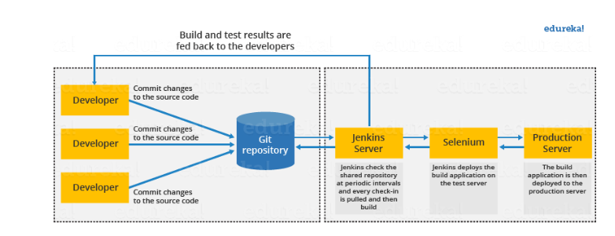

## SDLC - One year for production 

## Dev- QA- Production 
- 2000 - 2010 - 7months to production 
Not long ago: 
- Development -3 months, 
- QA testing - 3 months, 
- Deployment - 1 month

## AGILE/SCRUM 2011
- Time scale - 4 months
- 8 months earlier
- 4 months total  

## AGILE/SCRUM 
### Agile is the methodology with core principles
    - Agile values
### Scrum is the framework/implementation for this
    - scrum daily meeting
    - TDD
    - responding change by shortening lifecycle to 4weeks

### Agile/Scrum with DevOps
- Dev Cycle - 4 weeks 
- QA  (automated testing) - 10 minutes
- Deployment (automated testing- 10 minutes
- 11 months months earlier, 1 month total

Doesn't work with Tesla

### Saving time and money 
DevOps Four Pillars
- Ease of use: everyone on the team will use this, which is why documentation is important.
- Flexibility: things change at incredible rate, you don't want to change that fast but adapt accordingly.
- Robustness: we need 100% uptime, fast and robust deployment
- Cost: cost of downtime, cost of slow innovation, cost of time to market, cost of infrastructure

## Web Hook
web-hook is a an inverted api call, a location in the app where you receive calls to changes 
location to receive an API call 


## What is Jenkins?
Jenkins is an open-source automation tool written in Java with plugins built for continuous integration purposes. Used to build
and test software projects continuously to ease a developer's life to integrate changes to the project. Also
allows to continuously deliver software by integrating large number of tests and deployment technologies
(Git, Maven 2 project, Amazon EC2, HTML publisher etc.
)


1. Developers commit changes to the shared repository in Github
2. The jenkins checks the repo at intervals and proceeds to build 
3. Once the build has been confirmed to be successful, it will deployed into the test server
4. If the tests pass, the application is then deployed to the production server, otherwise feedback is sent back to the developer
5. Jenkins server iteratively checks the shared repo 

### Advantages: 
- It is an open-source tool with great community support.
- It is easy to install.
- It has 1000+ plugins to ease your work. If a plugin does not exist, you can code it and share it with the community.
- It is free of cost.
- It is built with Java and hence, it is portable to all the major platforms.

## Before and After Jenkins

Before Jenkins | After Jenkins
|--------------| -------------|
|The entire source code was built and then tested. Locating and fixing bugs in the event of build and test failure was difficult and time-consuming, which in turn slows the software delivery process.| Every commit made in the source code is built and tested. So, instead of checking the entire source code developers only need to focus on a particular commit. This leads to frequent new software releases.
Developers have to wait for test results|Developers know the test result of every commit made in the source code on the run.
The whole process is manual	|The whole process is manual	|

## What is a Pipeline?
A pipeline in a Software Engineering team is a set of automated processes that allow Developers and DevOps professionals to reliably and efficiently compile, build and deploy their code to their production compute platforms

## What is a CI/CD Pipeline?
- CI/CD pipeline automates your software delivery process
- The pipeline builds code, runs tests (CI), and safely deploys a new version of the application (CD).
- Automated pipelines remove manual errors, provide standardised feedback loops to developers, and enable fast product iterations.

## Master Branch and Develop Branch Breakdown
A Project invovles a minimum of two branches to record the history of a project, the ```Master``` and ```Develop``` Branch.
The master branch stores the official release history, whereas the develop serves as an integration branch for features. 
It is convenient ot tag all commits into master branch with a description and version number. 